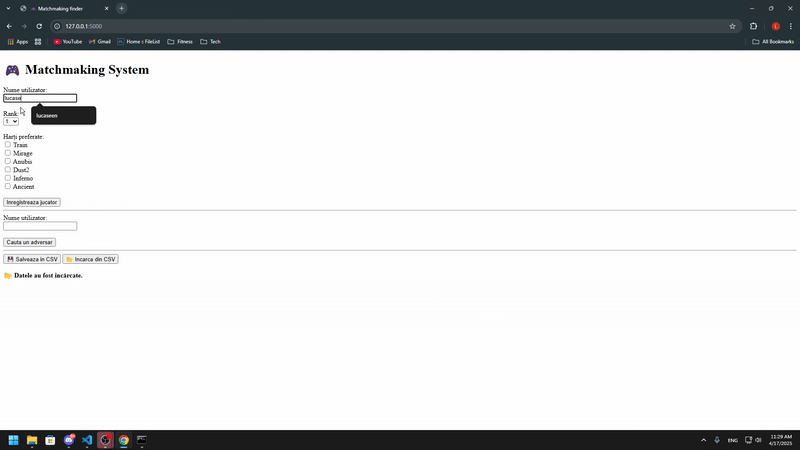

# 🎮 Matchmaking App (Flask)

Un mic proiect pentru un sistem de matchmaking simplu, creat cu Python si Flask. Aplicatia permite inregistrarea jucatorilor, salvarea datelor intr-un fisier `.csv` si cautarea automata a unui meci potrivit pe baza rank-ului si hartilor preferate.

## 📦 Ce contine

- `app.py` – aplicatia web finala cu Flask
- `matchmaking.py` – prima versiune a codului, complet comentata (draft)
- `users.csv` – exemplu de utilizatori pentru testare
- `documentatie.txt` – explicatii despre proiect, cum se foloseste si cum e structurat

## 🔧 Instalare

1. Instaleaza Flask:
pip install flask

2. Ruleaza aplicatia:
python app.py

3. Acceseaza in browser:
http://localhost:5000

## 🔍 Cum functioneaza

- Jucatorii se inregistreaza cu:
- username
- rank (1–10)
- harti preferate (ex: Mirage, Dust2 etc.)

- Aplicatia cauta un adversar cu acelasi rank si cel putin o harta comuna.

- Datele se pot salva/incarca din fisier CSV.

## 🧪 Exemplu de testare rapida

Poti incarca direct fisierul `users.csv` din aplicatie pentru a testa sistemul cu useri deja existenti.

## ℹ️ Alte info

Codul din `matchmaking.py` e mai detaliat si are comentarii pentru fiecare parte. `app.py` e versiunea finala, mai curata si mai usor de inteles.

---
## 📽️ Demo

